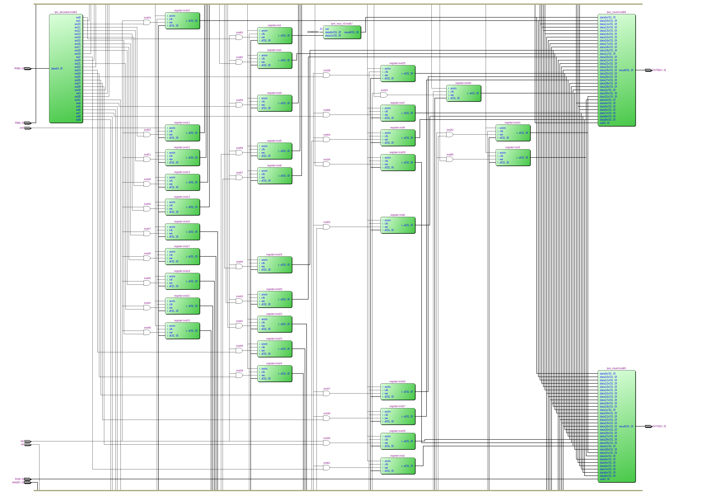

======================
Лабараторна робота №2
======================

Тема:
____________

Створення "Регістрового файлу"

Хід роботи:
_________

В даній лабараторній роботі потрібно реалізувати "Регістровий файл" з асинхронним скиданням, який буде мати 2 порта виводу інформації, 2 порта адреси для них. Також 1 порт для читання адреси регітра, в який буде записуватись інформація.
Для початку було описано 32-розрядний "flip-flop" регістр з асинхронним скиданням(``src/register.v``). Цей файл був успішно скомпільований, та перевірений в HDL симуляторі ``Cadence Incisive``.
"Регістровий файл" може одночасно считувати значення двох регістрів та записувати в один регістр нову інфрмацію, крім того використовується тільки 31 регістр (така особливість ``MIPS`` ядра.
Якщо намагатися считати з регістру ``R0`` ми завжди отримаємо "нулі".
Структурна схема "регістровго файлу" була взята з даного `джерела <https://drive.google.com/drive/folders/17GUVfdv4khRPolRkopDLgYgJJ-amIf6t>`__ та реалізована в середовищі ``Quartus``
На Рис.1.1 показано схему в ``RTL Viewer``. Крім того було просимульовано в HDL симуляторі ``Cadence Incisive``(Файл з сигналами ``waveform`` прикріплений до PR).

Рисунок 1.1 - Вигляд "регістровго файлу" в ``RTL Viewer``
.. image:: media/waveform.PNG
Рисунок 1.2 - Сигнали в середовищі ``Cadence Incisive``
Висновок:
_________

Вході виконання лабараторної роботи було синтезовано та перевірено "регістровий файл", який включає в себе 2 32-розрядких порта виводу інформації, вхід ``we``, асинхронне скидання ``arst``, 1 адресна шина для вибуру регістру в який буде записано інформацію(``RW``), 
2 шини для вибору считувальних регістрів (``RA``, ``RB``).
Було засвоєно основне призначення "регістровго файлу".
``waveform`` синтезованого "регістрового файлу" відповідає очікуванням.